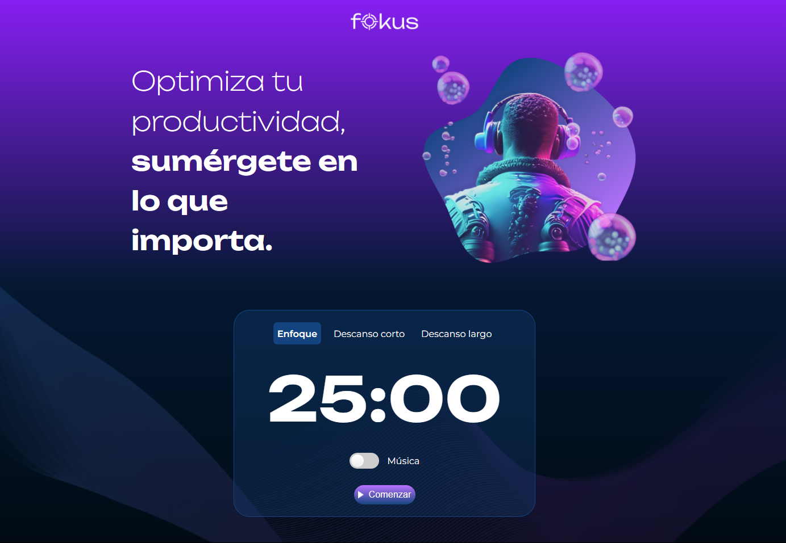

# Fokus App - Solución de Oracle One Education + Alura Latam

Este proyecto es una aplicación web llamada **Fokus App**, desarrollada como parte del programa de formación de Oracle One Education + Alura Latam.

## Tabla de contenidos

- [Visión general](#visión-general)
  - [Objetivo del proyecto](#objetivo-del-proyecto)
  - [Captura de pantalla](#captura-de-pantalla)
  - [Enlaces](#enlaces)
- [Mi proceso](#mi-proceso)
  - [Construido con](#construido-con)
  - [Lo que aprendí](#lo-que-aprendí)
  - [Desarrollo continuo](#desarrollo-continuo)
  - [Recursos útiles](#recursos-útiles)
- [Autor](#autor)
- [Agradecimientos](#agradecimientos)

## Visión general

### Objetivo del proyecto

El objetivo de este proyecto fue implementar un temporizador con las siguientes características:
- **Implementación del objeto Date:** Se usó el objeto `Date` de JavaScript para formatear minutos y segundos.
- **Configuración de diferentes temporizadores:** Se configuraron tres temporizadores para distintos contextos: enfoque, descanso corto y descanso largo.
- **Inserción del temporizador en pantalla:** Se creó la función `mostrarTiempo()` y se utilizó el método `innerHTML` para mostrar el temporizador en la pantalla.

### Captura de pantalla

### Enlaces

- URL de la solución: [Fokus App Repo](https://github.com/carlos-espipliego/one-focus-app/)
- URL del sitio en vivo: [Fokus App Demo](https://carlos-espipliego.github.io/one-focus-app/)

## Mi proceso

### Construido con

- **HTML5 semántico**
- **Propiedades personalizadas de CSS**
- **JavaScript ES6+**

### Lo que aprendí

En el desarrollo de esta aplicación, aprendimos:
- **Uso de `querySelector`:** Para manipular varios elementos en la página.
- **Objeto `Audio`:** Se utilizó junto con los métodos `play` y `pause`.
- **`addEventListener`:** Para escuchar eventos como `click` o `change`.
- **`classList`:** Para modificar clases de fondo en los botones.
- **Métodos `forEach`, `remove` y `setAttribute`:** Para recorrer, eliminar clases y cambiar rutas de imágenes, respectivamente.
- **Estructura `switch-case`:** Para cambiar textos de los botones.
- **`innerHTML` vs. `textContent`:** Diferencias entre estos dos métodos de modificación de contenido.

### Recursos útiles

- [Documentación oficial de JavaScript](https://developer.mozilla.org/es/docs/Web/JavaScript) - Información detallada sobre los métodos y conceptos empleados.

## Autor

- Sitio web - [Portfolio Web Carlos Espinoza](https://carlos-espipliego.github.io/portfolio-web/)
- LinkedIn - [carlos-espipliego](https://www.linkedin.com/in/carlosespipliego/)
- Github - [Carlos-EspiPliego](https://github.com/carlos-espipliego)

## Agradecimientos

Agradezco a Oracle One Education + Alura Latam por la oportunidad de participar en este proyecto.
